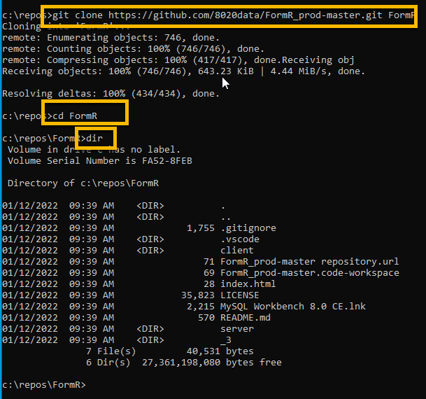
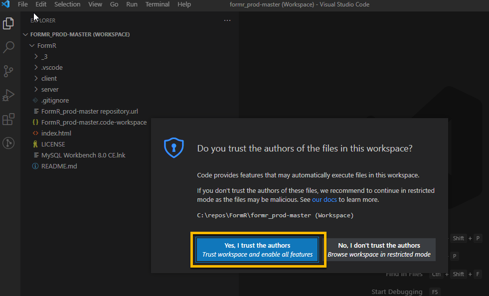
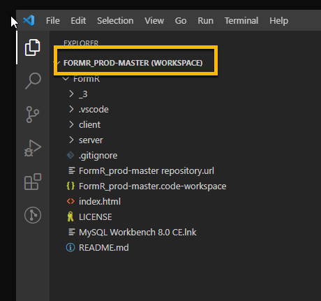
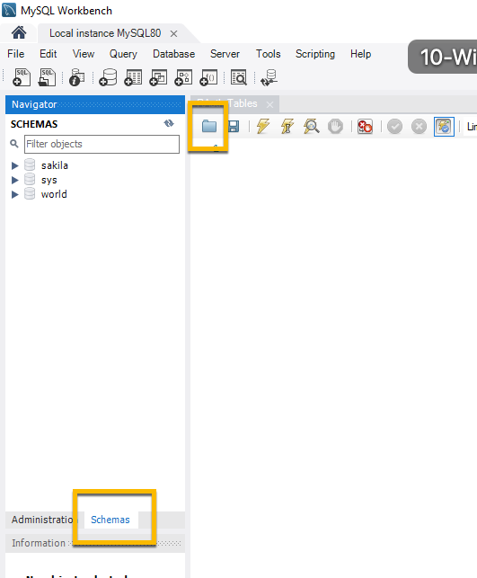
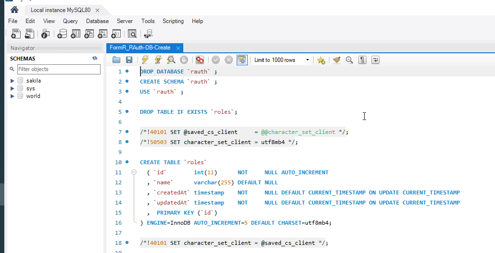
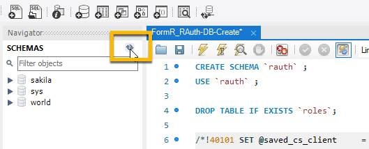
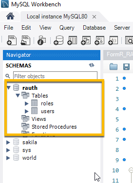
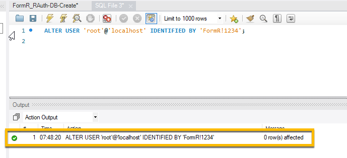
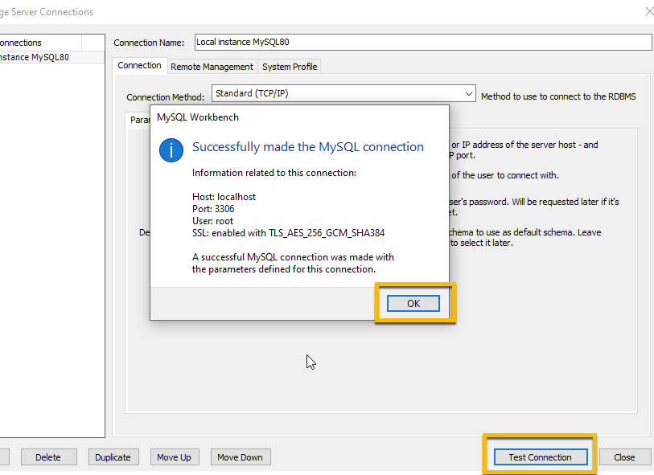
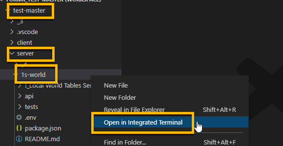

<!-- ------------------------------------------------------------------------- -->

<div class="page-back">

[BACK - Deploy my-react-app](/formR/fr0401_Deploy-My-Custom-App.md)
</div><div class="page-next">

[Deploy formR - NEXT](/formR/fr0401_Deploy-formR.md)
</div><div style="margin-top:35px">&nbsp;</div> 

<!-- ------------------------------------------------------------------------- -->

## 3.2 Clone formR 0:45 <!-- {docsify-ignore} -->
- [Purpose and Background](../Setup/purposes/pfr0103_Clone-formR.md)
- [Enter Comments in Discord](https://discord.com/channels/928752444316483585/959888948623187969)

#### Introduction <!-- {docsify-ignore} -->  
- In this topic you will clone the formR and test the applications on your local workstation.

#### Important note about names, capitalization, pictures and code copying <!-- {docsify-ignore} -->
- In this tutorial please be careful to use the Exact Spelling and Capitalization. You will be using Windows, Unix and GitBash command prompts. Improper captialization will cause commands to fail. Some examples are: Local_Admin, myProject, repos, remotes and .ssh.
- This documentation was produced in 2021-2022. You will experience differences in some of the pictures due to the changes made over time by the developers of the softwares and web sites that are used.
- We recommend that you cut and paste code snippets from the Documentation into your workstation/server. This will reduce the errors caused by hand typing.


----
### 1. Cloning formR repository  0:05
----
#### 1. Clone into the local repos folder using the Windows Command prompt

```
cd C:\repos\
```
 

 
```
git clone https://github.com/8020data/formR_prod-master.git formR

cd formR

dir
```



#### 2. From Windows command propt open with VSCode

```
code formR_prod-master.code-workspace
```


- If prompted, click "Yes I trust the authors".






----
### 2. Install Node modules  0:10
----
#### 1. Right click on the client folder

#### 2. Click Open in Integrated Terminal, then 


```
npm install
```


- This process takes several minutes. 

3. Test for vulnerabilities for production

```
npm audit --production
```


4. Right click on the server folder

5. Click Open in Integrated Terminal, then 


```
npm install 
```


3. Test for vulnerabilities for production

```
npm audit --production
```


----
### 3. Install RAuth and World databases 0:05
----
Note: The World sample database has been modified so that all tables contain ID primary key fields.

----

#### 1. Open MySQL Workbench by clicking its icon in your task bar or by searching for Workbench in the Windows search, then


#### 2. Click the Local Instance under MySQL Connections


3. Run Script file

    - Click on Schemas to show your current databases

    - Click on the Open a script file in this editor




4. Navigate to and Open: 

```
 C:\repos\formR\prod-master\_3\SQLs\formR_RAuth-DB-Create.
 sql

 then repeat these steps for:

 C:\repos\formR\prod-master\_3\SQLs\formR_World-DB-Create.sql
 
```

 



5. Click the Execute icon


6. Click the refesh icon above the schema list





7. IMPORTANT - Go back to Step 4. and repeat these same steps for the World DB file

```
 C:\repos\formR\prod-master\_3\SQLs\formR_World-DB-Create.sql
```

8. Close Workbench

----
### 4. Make sure that your MySQL password for root  is set to:  formR!1234 0:05
----
#### 1. Open MySQL Workbench by clicking its icon in your task bar or by searching for Workbench in the Windows search, then

#### 2. Click the Local Instance under MySQL Connections


3. Click the File tab, then click 'New Query Tab'

 

4. Enter the following into the Query window, then

```js
ALTER USER 'root'@'localhost' IDENTIFIED BY 'formR!1234';
```

5. Click the Execute icon




6. Close workbench and reopen it, then

7. Right click on the Local Instance, then

8. Click Edit Connection, then


9. Click Store in Vault, then

10. Enter the new password: formR!1234 and click OK


11. Click Test Connection then



12. Click Close and then close Workbench


----
 ### 5. Run Client and Server applications 0:10
----

#### 1. Right click on the server/1s-world folder and
#### 2. Click Open in Integrated Terminal, then 

 

```
npm start
```


3. Right click on the client/1c-world folder and
4. Click Open in Integrated Terminal, then 

(Note: The client application can take up to 15 minutes to start for the first time)


```
npm start
```


----
### 6. Test the applications on your local workstation 0:10
----
#### 1. Enter each of the following in your browser to test the server:

```
    localhost:50251
    localhost:50251/api/world/cities/test
    localhost:50251/api/world/cities/model
    localhost:50251/api/world/cities/
    localhost:50251/api/world/cities/1

    localhost:50251/api/world/countries/test
    localhost:50251/api/world/countries/model
    localhost:50251/api/world/countries/
    localhost:50251/api/world/countries/1
```

#### 2.  Enter the following in your browser to test the client:

```
    localhost:50201
```

----
 ### 6. Install FRTools 0:10
----

# Not Ready Yet


#### 1. Set System Path to contain: C:\repos\formR\_2\bin
   - Click Start, type env, select: Edit the system environment variables
   - Click on button, Environment Variables
   - Under System (not User) variables, select Path, then click Edit...
   - Click on button, New, then type: C:\repos\formR\_2\bin
   - Click Ok three times

#### 2. Get formR Tools from 8020data GitHub repository
   - From Windows command prompt enter: 

```
cd C:/Repos/formR

git https://github.com/8020data/FRTools.git     tools
```

3. Create a link from ./formR/_2  ./formR/tools/_2 to
   - Open Windows Command prompt Run as Administrator  BT-NEED screen shot

``` 
cd C:\Repos\formR

mklink /d _2 tools\_2
```

4. Run FRTools command
   - $ frt  


----
#### Congratulations! You have Cloned formR successfully to your local workstation.
----


<!-- ------------------------------------------------------------------------- -->

<div class="page-back">

[BACK - Deploy my-react-app](/formR/fr0401_Deploy-My-Custom-App.md)
</div><div class="page-next">

[Deploy formR - NEXT](/formR/fr0401_Deploy-formR.md)
</div>

<!-- ------------------------------------------------------------------------- -->
