<!-- ------------------------------------------------------------------------- -->

<div class="page-back">

[BACK - Test NodeJS](/Setup/fr0102_Test-Node.md)
</div><div class="page-next">

[Harden Ubuntu - NEXT](/Setup/fr0302_Setup-Hardening-Ubuntu.md)
</div><div style="margin-top:35px">&nbsp;</div>

<!-- ------------------------------------------------------------------------- -->

## 2.1 Create Vultr Ubuntu 0:25 <!-- {docsify-ignore} -->
<div class="notice-tip">
  <div class="notice-tip-header">
    Tip: <a href="../Setup/purposes/pfr0301_Setup-Vultr-Ubuntu.md" target="_blank">Link to Background and Purposes</a> 
  </div>  
</div>

<div class="notice-tip">
  <div class="notice-tip-header">
    Tip: <a href="https://discord.com/channels/928752444316483585/931217076885008495" target="_blank">Link to Discord for Your Comments</a> 
  </div>  
</div>

#### Introduction <!-- {docsify-ignore} -->
- In order to test our formR apps on the Internet  we will create an Ubuntu server on the cloud provider, Vultr.com. 
- Vultr costs under $10 per month. 
- Please use the following link when you begin:

```
https://www.vultr.com/?ref=8778592
```

<details class="details-style">
    <summary class="summary-style">
More Info: Names, Caps, Picts, Code Copy
    </summary>
    <div class="popup">

- In this tutorial please be careful to use the Exact Spelling and Capitalization. You will be using Windows, Unix and GitBash command prompts. Improper captialization will cause commands to fail. Some examples are: Local_Admin, myProject, repos, remotes and .ssh.

- This documentation was produced in 2021-2022. You will experience differences in some of the pictures due to the changes made over time by the developers of the softwares and web sites that are used.

- We recommend that you copy and paste code snippets from the documentation into your workstation/server. This will reduce the errors caused by hand typing.
Hover over the snippet and click copy, then paste as appropriate.

</div>
</details>


----
### 1. Create New Ubuntu Instance  0:10
----
#### 1. Signin or create an account on vultr.com 


<div class="notice-tip">
  <div class="notice-tip-header">
    Note: the ref=8778592 below tells Vultr and us that you are doing the formR tutorial.
  </div>  
</div>

- Browse to:

```
https://www.vultr.com/?ref=8778592
```

#### 2. Deploy New Server 

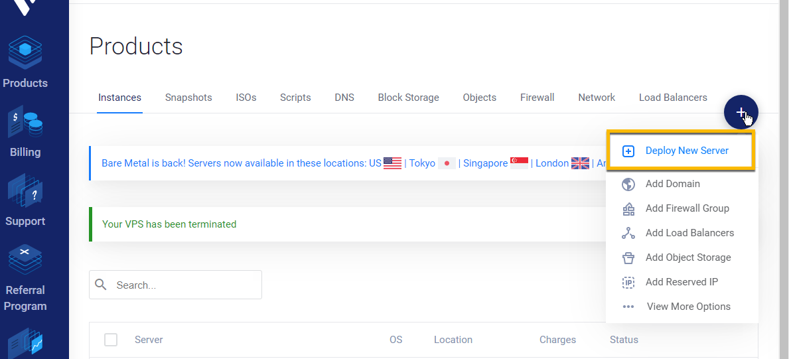

#### 3. Choose Server: Cloud Compute


#### 4. CPU and Storage


#### 5. Server Location

<div class="notice-tip">
  <div class="notice-tip-header">
    Tip: Select a location near to you.</a> 
  </div>
</div>

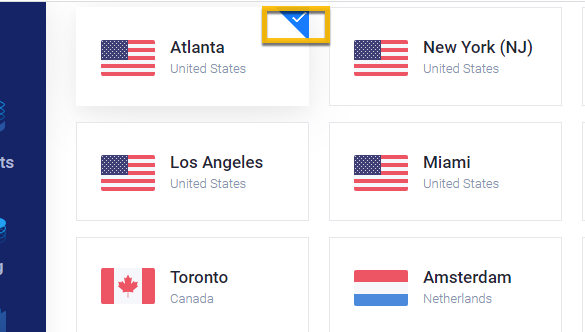

#### 6. Server Image: Ubuntu choose the highest version for the formR tutorial.


#### 7. Server Size: 25GB


#### 8. Add SSH Key

- Select your Vultr public key in C:\users\Local_Admin\\.ssh

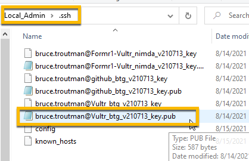

- Open the file in Notepad and copy the key 


- Paste the key value into the Vultr SSH Key box and give the key a name.


#### 9. Auto Backup = Off


#### 10. Server Hostname and Label: 

- Use Vultr-FormR0 for both


#### 11. Click Deploy Now

<div class="notice-tip">
  <div class="notice-tip-header">
    Info: Deploy now takes a few minutes to complete.</a> 
  </div>
</div>


- Installing


#### 12. Connect from Your Workstation via ssh

<div class="notice-tip">
  <div class="notice-tip-header">
    Info: This connection confirms your access from workstation to server.</a> 
  </div>
</div>

- Open a command window on your workstation


- At the command prompt enter:

```
ssh root@(your Vultr server ip address-copy from Vultr)
```


- Enter yes for Continue connecting


- Enter your Vultr password (copy from Vultr)

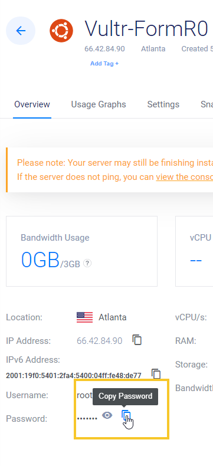

- Right click in the command window and Edit Paste the password


- Success

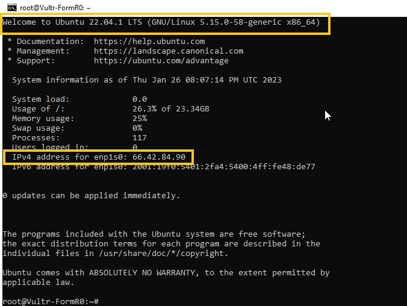

----
### 2. Use Bitvise to access Vultr-FormR0  0:15
----
#### 1. Open Bitvise


#### 2. Click New Profile

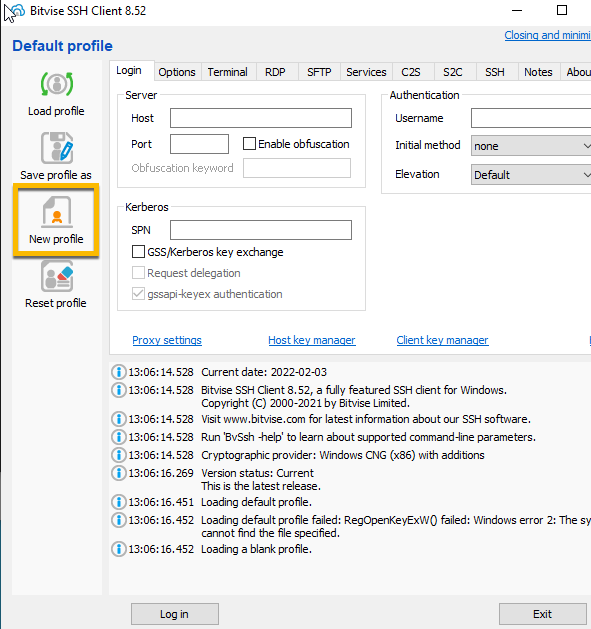

#### 3. Enter new profile name

```
Vultr-FormR0-root.tlp
```

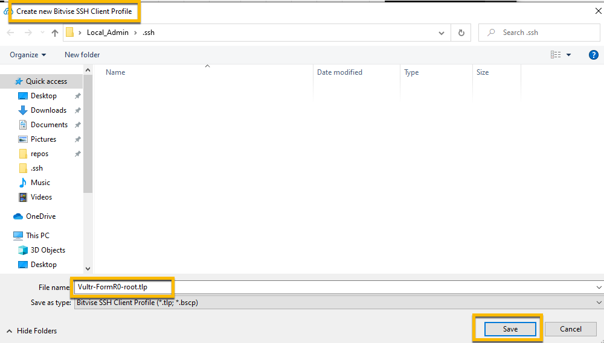

#### 4. Fill in the following:

- Host = Vultr-FormR0 IP Address (copy from Vultr web page)

- Port = 22

- Username = root

- Initial Method = password

- Click Checkbox - Store encrypted password in profile

- Password = Vultr-FormR0 root password (copy from Vultr web page)

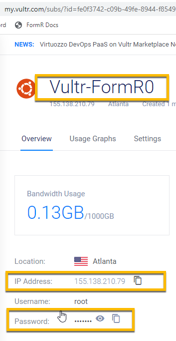

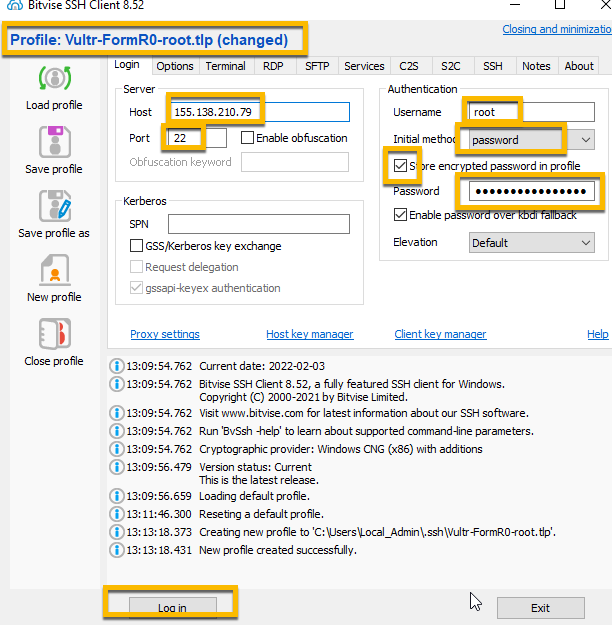

#### 5. Click Login

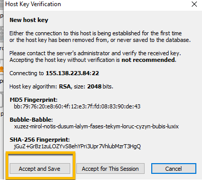

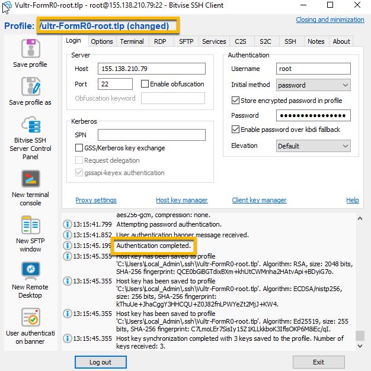

#### 6. Save Profile

<div class="notice-warning">
  <div class="notice-warning-header">
    Important: Save Profile -- Don't Lose Your Work
  </div>
</div>  


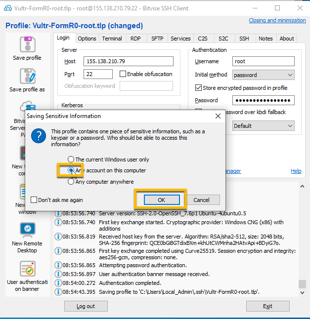


#### 6. Click New terminal console button


#### 7. You will see the Welcome screen for Ubuntu and the command prompt:

    root@Vultr-FormR0:~#


----
<div class="notice-success">
  <div class="notice-success-header">
    Congratulations! You have created your Ubuntu server on Vultr.
  </div>
</div>

----


<!-- ------------------------------------------------------------------------- -->

<div class="page-back">

[BACK - Test NodeJS](/Setup/fr0104_Test-Node.md)
</div><div class="page-next">

[Harden Ubuntu - NEXT](/Setup/fr0302_Setup-Hardening-Ubuntu.md)
</div>


