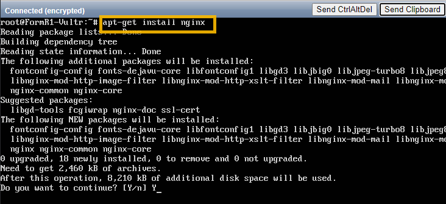
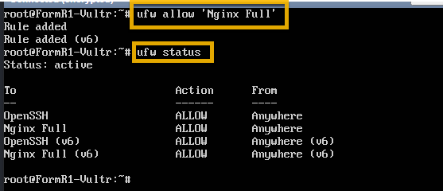

<!-- ------------------------------------------------------------------------- -->

<div class="page-back">

[BACK - Harden Ubuntu     ](/Setup/fr0302_Setup-Hardening-Ubuntu.md)
</div><div class="page-next">

[Install App Server - NEXT](/Setup/fr0304_Setup-App-Server-Ubuntu.md)
</div><div style="margin-top:35px">&nbsp;</div>

<!-- ------------------------------------------------------------------------- -->

## 2.3 Install Web Server (<20 mins)
#### [Purpose and Background](../Setup/purposes/pfr0303_Setup-Web-Server-Ubuntu.md)

#### Introduction


#### Important note about names, capitalization and pictures
- In this tutorial please be careful to use the Exact Spelling and Capitalization. You will be using Windows, Unix and GitBash command prompts. Improper captialization will cause commands to fail. Some examples are: Local_Admin, myProject, repos, remotes and .ssh.
- This documentation was produced during 2021. You will experience differences in some of the pictures due to the changes made over time by the developers of the softwares and web sites that are used.

----
 ### 1. Restart your Vultr VM and Login  (<5 mins)
----
 1. Login the your Vultr FormR0 console and click the Restart button


 2. From your Vultr FormR0 console
 
 3. Copy the root password
 
 4. Click View Console button
 


5. Login as root using the Send Clipboard button


----
### 2. Install nginx (<5 mins)

1. Install
----
```
apt-get install nginx
```



2. Check
```
nginx -t
```


3. Enable nginx to auto start

```
systemctl enable nginx
```


4. Allow http & https through firewall
```
ufw allow 'Nginx Full'
```



5. Test the default web site by IP. 

6. Get the server IP from Vultr


7. Browse to your server's IP address.

```
http://xxx.xxx.xxx.xxx
```


----
### 3. Install Certbot  (<5 mins)
----
1. Install  (Certbot is used to create SSL certificates using LetsEncrypt.)

```
apt-get install python-certbot-nginx
```


----
### 4. Create webs directory (<5 mins)
----
1. Create a directory to hold your applications.

```
mkdir /webs
```

2. Check that /webs directory was created

```
cd /
ls -ld /webs
```


----
#### Congratulations! You have installed a Web server on your Ubuntu server.
----

<!-- ------------------------------------------------------------------------- -->

<div class="page-back">

[BACK - Harden Ubuntu     ](/Setup/fr0302_Setup-Hardening-Ubuntu.md)
</div><div class="page-next">

[Install App Server - NEXT](/Setup/fr0304_Setup-App-Server-Ubuntu.md)
</div>

<!-- ------------------------------------------------------------------------- -->

