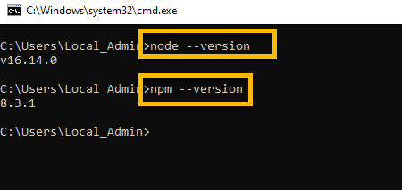

<!-- ------------------------------------------------------------------------- -->

<div class="page-back">

[BACK - Install Web Server     ](/Setup/fr0303_Setup-Web-Server-Ubuntu.md)
</div><div class="page-next">

[Install Data Server - NEXT](/Setup/fr0305_Setup-Data-Server-Ubuntu.md)
</div><div style="margin-top:35px">&nbsp;</div>

<!-- ------------------------------------------------------------------------- -->


## 2.4 Install App Server 0:25 <!-- {docsify-ignore} -->
<div class="notice-tip">
  <div class="notice-tip-header">
    Tip: <a href="../Setup/purposes/pfr0304_Setup-App-Server-Ubuntu.md" target="_blank">Link to Background and Purposes</a> 
  </div>  
</div>

<div class="notice-tip">
  <div class="notice-tip-header">
    Tip: <a href="https://discord.com/channels/928752444316483585/931218086256857118" target="_blank">Link to Discord for Your Comments</a> 
  </div>  
</div>

#### Introduction <!-- {docsify-ignore} -->
- You will be using NodeJS to run your applications.
- nvs (node versuion selector) will help you manazge Nodejs
- pm2 will be used for running your simpleApp.
- express will be used for ?????????

<details class="details-style">
    <summary class="summary-style">
More Info: Names, Caps, Picts, Code Copy
    </summary>
    <div class="popup">

- In this tutorial please be careful to use the Exact Spelling and Capitalization. You will be using Windows, Unix and GitBash command prompts. Improper captialization will cause commands to fail. Some examples are: Local_Admin, myProject, repos, remotes and .ssh.

- This documentation was produced in 2021-2022. You will experience differences in some of the pictures due to the changes made over time by the developers of the softwares and web sites that are used.

- We recommend that you copy and paste code snippets from the documentation into your workstation/server. This will reduce the errors caused by hand typing.
Hover over the snippet and click copy, then paste as appropriate.

</div>
</details>

----
### 1. Restart your Vultr VM and Login 0:05

----
#### 1. Open Bitvise and click Login


#### 2. Click New terminal console


#### 3. Enter:

```
reboot
```


- Close the Terminal window and wait for Bitvise to automatically login

#### 4. From Bitvise click New terminal console


<div class="notice-tip">
  <div class="notice-tip-header">
    Note: To paste commands into the terminal, right-click at the terminal prompt
  </div>  
</div>  

----
### 2. Install nvs (node version selector) 0:05
----

#### 1. Install 

- NVS_HOME

```
export NVS_HOME="$HOME/.nvs"
```

- Clone nvs

```
git clone https://github.com/jasongin/nvs "$NVS_HOME"
```

- Install

```
. "$NVS_HOME/nvs.sh" install

```


----
### 3. Install nodejs and npm Node package Manager 0:05
----

#### 1. Add and use node version 16 latest version 

```
nvs add 16
```
```
nvs use 16
```
```
nvs link
```

- nvs link sets version 16 as the default


#### 2. Check

```
node --version
```
```
npm --version
```



----
### 4. Install  pm2 0:05
----

#### 1. Install
```
npm install -g pm2
```


#### 2. Check
```
ps -aux | egrep 'pm2'
```


#### 3. Configure pm2 to start automatically on system startup
```
pm2 startup systemd
```


----
### 5. Install Express 0:05
----

#### 1. Install 

```
cd /webs
```
```
npm init
```

- Select all defaults by pressing enter,
then enter Y for "Is this ok?"


```
npm install express
```


----
<div class="notice-success">
  <div class="notice-success-header">
    Congratulations! You have installed an Application server on your Ubuntu server.
  </div>
</div>

----

<!-- ------------------------------------------------------------------------- -->

<div class="page-back">

[BACK - Install Web Server     ](/Setup/fr0303_Setup-Web-Server-Ubuntu.md)
</div><div class="page-next">

[Install Data Server - NEXT](/Setup/fr0305_Setup-Data-Server-Ubuntu.md)
</div>

<!-- ------------------------------------------------------------------------- -->

