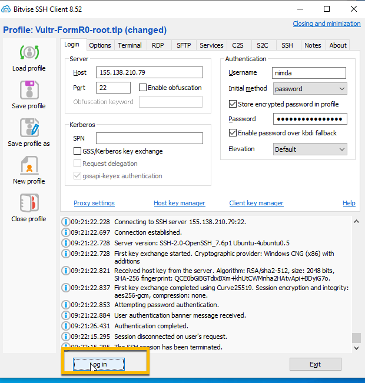
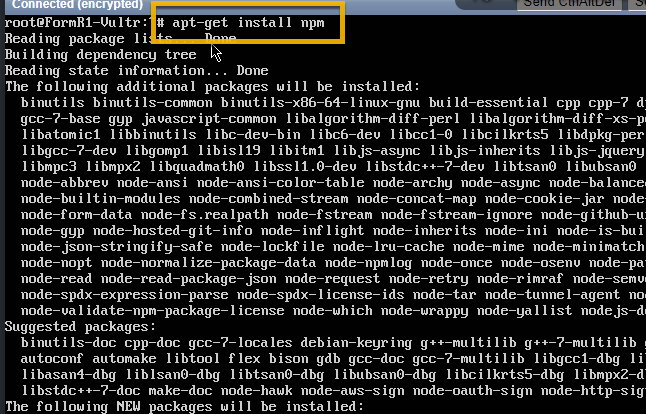
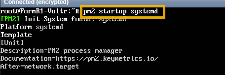
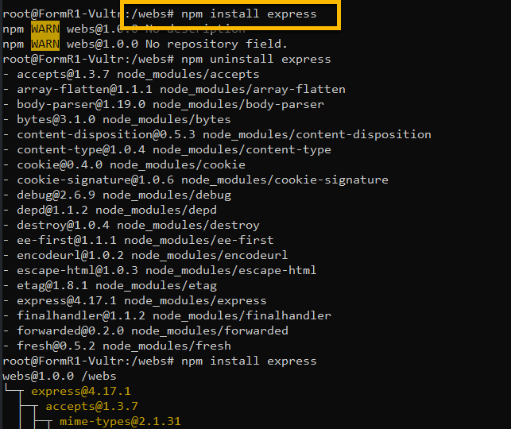

<!-- ------------------------------------------------------------------------- -->

<div class="page-back">

[BACK - Install Web Server     ](/Setup/fr0303_Setup-Web-Server-Ubuntu.md)
</div><div class="page-next">

[Install Data Server - NEXT](/Setup/fr0305_Setup-Data-Server-Ubuntu.md)
</div><div style="margin-top:35px">&nbsp;</div>

<!-- ------------------------------------------------------------------------- -->


## 2.4 Install App Server 
#### [Purpose and Background](../Setup/purposes/pfr0304_Setup-App-Server-Ubuntu.md)

#### Introduction


#### Important note about names, capitalization and pictures
- In this tutorial please be careful to use the Exact Spelling and Capitalization. You will be using Windows, Unix and GitBash command prompts. Improper captialization will cause commands to fail. Some examples are: Local_Admin, myProject, repos, remotes and .ssh.
- This documentation was produced during 2021. You will experience differences in some of the pictures due to the changes made over time by the developers of the softwares and web sites that are used.

----
### 1. Restart your Vultr VM and Login
----
1. Login the your Vultr FormR1 console and click the Restart button


2. From your Vultr FormR1 console
 
3. Copy the root password
 
4. Click View Console button
 


5. Login as root using the Send Clipboard button



----
### 2. Install nodejs
----

1. Install
```
apt-get install nodejs
```


2. Check
```
nodejs --version
```


----
### 3. Install npm
----

1. Install
```
apt-get install npm
```



2. Check
```
npm --version
```


----
### 4. Install  pm2
----

1. Install
```
npm install -g pm2
```


2. Check
```
ps -aux | egrep 'pm2'
```


3. Configure pm2 to start automatically on system startup
```
pm2 startup systemd
```



----
### 5. Install Docsify
----

1. Install

```
 npm install docsify -g
```


2. Check

```
ps -aux | egrep 'docsify'
```


----
### 6. Install Express
----

1. Install 

```
cd /webs
npm init

Select all defaults by pressing enter,
then enter Y for "Is this ok?"
```


```
npm install express
```




----
#### Congratulations! You have installed an Application server on your Ubuntu server.
----

<!-- ------------------------------------------------------------------------- -->

<div class="page-back">

[BACK - Install Web Server     ](/Setup/fr0303_Setup-Web-Server-Ubuntu.md)
</div><div class="page-next">

[Install Data Server - NEXT](/Setup/fr0305_Setup-Data-Server-Ubuntu.md)
</div>

<!-- ------------------------------------------------------------------------- -->

