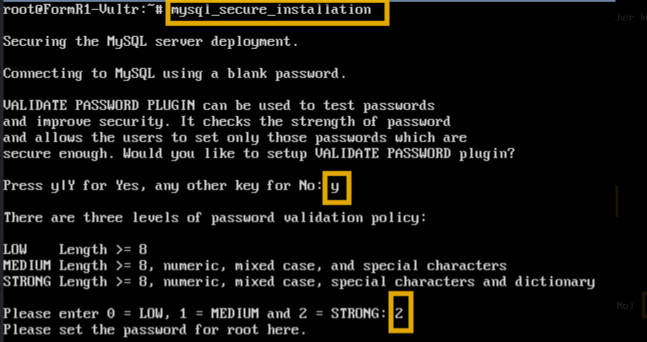
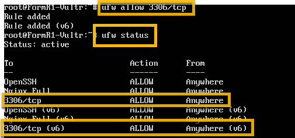
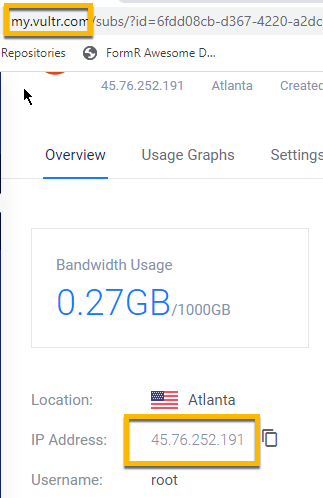
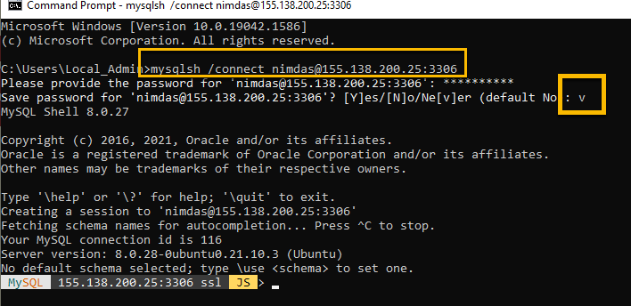

<!-- ------------------------------------------------------------------------- -->

<div class="page-back">

[BACK - Install App Server ](/Setup/fr0304_Setup-App-Server-Ubuntu.md)
</div><div class="page-next">

[Install Website SSL - NEXT](/Setup/fr0306_Setup-Website-SSL-Ubuntu.md)
</div><div style="margin-top:35px">&nbsp;</div>

<!-- ------------------------------------------------------------------------- -->

## 2.5 Setup Instructions for Data server using MySQL on a Vultr Ubuntu VM [](../Setup/purposes/pfr0305_Setup-Data-Server-Ubuntu.md)


----
### 1. Restart your Vultr VM and Login
----
1. Login the your Vultr FormR1 console and click the Restart button


2. From your Vultr FormR1 console
 
3. Copy the root password
 
4. Click View Console button
 


5. Login as root using the Send Clipboard button


----
### 2. Install MySQL from the Vultr FormR1 console
----
1. Install MySQL
```
apt-get install mysql-server
```


2. Check installation
```
mysql --version
```


----
### 3. Secure MySQL
----
1. Lock down MySQL - Running this script will ask you

```
mysql_secure_installation

      - Add VALIDATE PASSWORD PLUGIN: Yes
      - Enter a "password validation policy level": 2
      - Enter a password for the user, root, to login to MySQL: FormR!1234
      - Remove anonymous users? Yes
      - Disallow root login remotely? No (Yes on a production server)
      - Remove test database and access to it? No 
      - Reload privilege tables now? Yes
```




2. Allow remote access to MySQL 

```
nano /etc/mysql/mysql.conf.d/mysqld.cnf

Change line:         bind-address = 127.0.0.1
to:                  bind-address = 0.0.0.0
```


3. Save the file

4. Restart mysql and comfirm its running

```
systemctl restart mysql.service
netstat -tulnp | grep mysql
```


5. Open firewall rule for port 3306
```
ufw allow 3306/tcp

ufw status   
```



6. Create and Grant Privileges to user account: nimdas with host %
(Note: root@localhost has all rights and nimdas@% will have all rights) 

7. From the Vultr console prompt enter:

```
mysql -p
```

8. Enter : the root password -> FormR!1234

```
password: FormR!1234

#### !! Remember to write your passwords in a safe place !!
```

9. Enter the following:

```
mysql> CREATE USER 'nimdas'@'%' IDENTIFIED WITH mysql_native_password BY 'FormR!1234';
mysql> GRANT ALL PRIVILEGES ON *.* TO 'nimdas'@'%';
mysql> SELECT user,authentication_string,plugin,host FROM mysql.user;
```


10. Exit mysql
```
mysql> \quit
```


11. Stop, Start and check status of MySQL
```
systemctl stop mysql
systemctl start mysql
systemctl status mysql.service
```


----
### 4. Login as nimdas remotely from your local PC with MySQL Shell. --Don't save the password-- 
----
1. From Windows command prompt enter the following: (Use your Vultur server IP address)



```
mysqlsh /connect nimdas@xxx.xxx.xxx.xxx:3306
```
2. Check Version. From the mysql command prompt enter the following:

```
\sql SELECT VERSION();
```


 
3. Exit mysqlsh. From the mysql command prompt enter the following:

```
\quit
```

----
### Congratulations! You have installed a Database server on your Ubuntu server.
----

<!-- ------------------------------------------------------------------------- -->

<div class="page-back">

[BACK - Install App Server ](/Setup/fr0304_Setup-App-Server-Ubuntu.md)
</div><div class="page-next">

[Install Website SSL - NEXT](/Setup/fr0306_Setup-Website-SSL-Ubuntu.md)
</div>

<!-- ------------------------------------------------------------------------- -->
